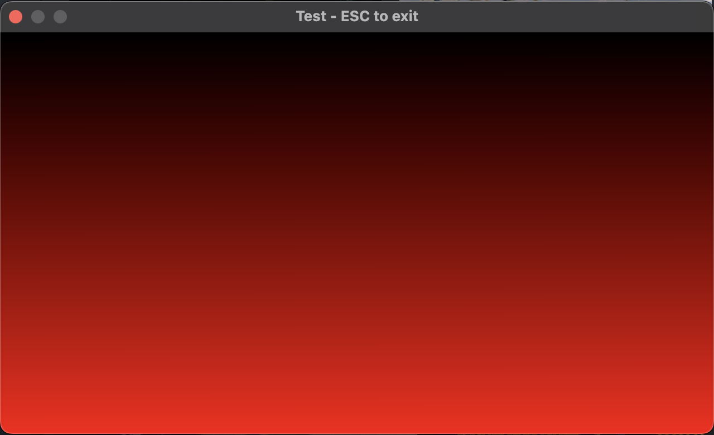
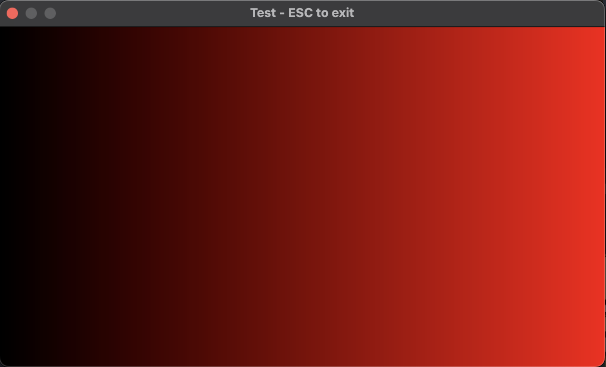

# Simulation de sable qui tombe

Le but de ce projet est de créer une fenêtre dans laquelle on peut faire
apparaitre des grains de sable en cliquant avec la souris. Les grains de sables
doivent tomber de manière « réaliste » et « glisser » sur les autres si l'angle
le permet.

## 1) Afficher une fenêtre

Il y a énormément de manière de créer des fenêtres quelque soit le langage.
Pour ce projet nous allons utiliser `minifb` qui est assez simple et nous laisse
envoyer un tableau de pixel a afficher.

### Ajouter une librairie au projet

```bash
cargo add minifb
```

### Ouvrir une fenêtre vide

On va créer un main tout simple avec le contenu du [README de `minifb`](https://github.com/emoon/rust_minifb):
```rust
use minifb::{Key, Window, WindowOptions};

const WIDTH: usize = 640;
const HEIGHT: usize = 360;

fn main() {
    let mut buffer: Vec<u32> = vec![0; WIDTH * HEIGHT];

    let mut window = Window::new(
        "Test - ESC to exit",
        WIDTH,
        HEIGHT,
        WindowOptions::default(),
    )
    .unwrap_or_else(|e| {
        panic!("{}", e);
    });

    // Limit to max ~60 fps update rate
    window.limit_update_rate(Some(std::time::Duration::from_micros(16600)));

    while window.is_open() && !window.is_key_down(Key::Escape) {
        for i in buffer.iter_mut() {
            *i = 0; // write something more funny here!
        }

        // We unwrap here as we want this code to exit if it fails. Real applications may want to handle this in a different way
        window
            .update_with_buffer(&buffer, WIDTH, HEIGHT)
            .unwrap();
    }
}
```

En lançant ce code une fenêtre noire devrait s'ouvrir. On va voir ensemble le but de chaque partie de ce programme :

#### Mise en place de la résolution de la fenêtre

```rust
const WIDTH: usize = 640;
const HEIGHT: usize = 360;
```

Ces deux lignes définissent la taille de la fenêtre, `640` pixels de largeur et `360` pixels de hauteur.

#### Création du buffer de la fenêtre

```rust
    let mut buffer: Vec<u32> = vec![0; WIDTH * HEIGHT];
```

Cette ligne donne beaucoup d'informations très importante sur le fonctionnement du programmes.
Elle initialise un buffer **mutable** qui représente l'image a afficher dans la fenêtre.
Si le vecteur est mutable c'est parce qu'on va pouvoir mettre à jour l'image à chaque fois qu'un grain de sable bouge.

##### Des images en 1D ou en 2D ??

Ensuite, il y a quelque chose qui devrait te sembler bizarre c'est que le type est un simple `Vec<_>` plutôt qu'un `Vec<Vec<_>>`.
Ce qui veut dire que l'ont va représenter une image en 2D avec un vecteur en 1D:
Par exemple pour représenter cette image:
```
.\o/.
..|..
./.\.
```

Naivement en rust on pourrait vouloir écrire :
```rust
vec![
  vec!['.', '\', 'o', '/', '.'], 
  vec!['.', '.', '|', '.', '.'], 
  vec!['.', '/', '.', '\', '.'], 
  ],
]
```

Mais pour économiser de la mémoire et rendre l'affichage plus rapide `minifb` demande à recevoir l'image formattée de cette manière :

```rust
vec!['.', '\', 'o', '/', '.', '.', '.', '|', '.', '.', '.', '/', '.', '\', '.']
```

Ou avec des retours à la ligne plus sympa :

```rust
vec![
  '.', '\', 'o', '/', '.', 
  '.', '.', '|', '.', '.', 
  '.', '/', '.', '\', '.', 
]
```

Ensuite, pour comprendre les « délimitations » de chaque ligne alors que tout est contigue ce sera a nous d'indiquer à `minifb` au moment d'afficher une nouvelle image la `WIDTH` et la `HEIGHT`.
Lui de son côté il pourra se débrouiller pour re découper le vecteur en une dimension en un vecteur en deux dimensions.
Par contre il est très important que le vecteur fasse contienne exactement autant de valeur qu'il y a de pixels.
C'est à dire `WIDTH * HEIGHT` pixels.
On retombe donc sur la taille initiale déclarée du buffer :
```rust
    let mut buffer: Vec<u32> = vec![0; WIDTH * HEIGHT];
    //                                 ^^^^^^^^^^^^^^
    //              Ici le vecteur contient bien WIDTH * HEIGHT éléments
```

##### Mais c'est quoi un pixel

Maintenant qu'on sait où est-ce qu'il faut écrire dans le vecteur pour afficher un pixel.
Il faut savoir **quoi** écrire dans le vecteur.
Dans le type déclaré sur l'exemple de `minifb` ils utilisent des `u32`.

```rust
    let mut buffer: Vec<u32> = vec![0; WIDTH * HEIGHT];
    //                  ^^^         ^
    //             Des `u32` qui valent zéro ???
```

C'est parce que ce `u32` représente en réalité 4 `u8` ensemble :
1. Rien
2. Le rouge
3. Le vert
4. Le bleu

En écrivant `0` dans le vecteur, il n'y a ni rouge, ni vert, ni bleu donc le pixel est noir.
Si on écrit `u32::MAX` a la place alors on aura le maximum de rouge, vert et bleu et ça fera un pixel blanc.

/!\ Attention, si tu testes tu dois le modifier a la fois à la ligne `30`
avec la valeur par défaut et `47` où les valeurs sont mises à jour pour chaque
images.

Voilà quelques exemple de couleurs en hexadécimal :
```rust
0x00_00_00_00 // Pareil que `0`, un pixel noir
0x00_ff_00_00 // Du rouge
0x00_00_ff_00 // Du vert
0x00_00_00_ff // Du bleu
0x00_12_34_56 // Un mélange de couleur
0x00_ff_ff_ff // Du blanc
0xff_ff_ff_ff // Du blanc aussi, pareil que `u32::MAX`
// Et on remarque que les deux premières valeur ne servent effectivement jamais a rien. En général ça sert a gérer la transparence, mais dans minifb ça ne sert a rien.
```

#### Création de la fenêtre


```rust
    let mut window = Window::new(
        "Test - ESC to exit", // le nom de la fenêtre
        WIDTH, // Ici on spécifie la taille initiale de la fenêtre, ça pourra changer dans le futur
        HEIGHT,
        WindowOptions::default(), // On peut spécifier des options a l'ouverture de la fenêtre mais on ne vas pas le faire
    )
    .unwrap_or_else(|e| { // Si ça ne fonctionne pas, on plante
        panic!("{}", e);
    });
```

#### On fixe le nombre maximul d'image par seconde

Dans le cas d'un programme qui s'exécute très vite on ne veut pas que la fenêtre
se mette a jour des millions de fois par seconde et fasse ramer tout l'ordi
donc en général on fixe une limite au nombre d'image que l'on peut afficher
par seconde pour être sûr qu'on ne fasse pas de travail inutile.


```rust
    // Limit to max ~60 fps update rate
    window.limit_update_rate(Some(std::time::Duration::from_micros(16600)));
```

Ici, ils indiquent qu'on peut afficher une image toutes les 16_600 micro secondes.
[Ça correspond a 60 images pour secondes](https://numbat.dev/?q=1s+%2F+60+-%3E+us%E2%8F%8E).

Une manière plus lisible de l'écrire en rust serait comme ça :
```rust
    // Limit to max ~60 fps update rate
    window.limit_update_rate(Some(std::time::Duration::from_secs(1) / 60));
```

Souvent on conseille de faire entre 30 images par seconde, ou le maximum que
l'écran peut faire. Souvent 60, mais des fois 120 ou 240 images par secondes.
Dans notre cas, 60 images par seconde c'est bien.

#### L'exécution du programme

Jusqu'à présent tout ce qu'on a fait c'est se préparer a exécuter un programme avec une fenêtre. Mais il ne s'est encore rien passé.
C'est ici que tout se passe :

```rust
    while window.is_open() && !window.is_key_down(Key::Escape) {
        for i in buffer.iter_mut() {
            *i = 0; // write something more funny here!
        }

        // We unwrap here as we want this code to exit if it fails. Real applications may want to handle this in a different way
        window
            .update_with_buffer(&buffer, WIDTH, HEIGHT)
            .unwrap();
    }
```

##### La boucle principale

Cette boucle `while` est vraiment la boucle principale d'exécution du programme,
c'est ici que tout se passe et lorsqu'on sort de la boucle alors le programme
s'arrête.
```rust
    while window.is_open() && !window.is_key_down(Key::Escape) {
```

Il y a deux conditions d'arrêts ici, il faut que :
- `window.is_open()` - La fenêtre soit encore ouverte (i.e.: l'utilisateur n'as pas cliqué sur la croix rouge en haut a gauche)
- `&& !window.is_key_down(Key::Escape)` - Et que l'utilisateur n'ait pas appuyé sur la touche `echap`

##### La mise à jour du buffer
```rust
        for i in buffer.iter_mut() {
            *i = 0; // write something more funny here!
        }
```

Pour cet exemple on se balade simplement sur toutes les valeurs du buffer et on les mets à zéro.

##### La mise à jour de la fenêtre

Lorsqu'on a mis à jour le buffer il ne s'est rien passé, c'est seulement en donnant le buffer à `minifb` qu'il mettra à jour la fenêtre :

```rust
        // We unwrap here as we want this code to exit if it fails. Real applications may want to handle this in a different way
        window
            .update_with_buffer(&buffer, WIDTH, HEIGHT)
            .unwrap();
```

Et comme on l'as vu plus tôt, `minifb` ne sait pas comment afficher le `buffer` tout seul et il faut qu'on lui re-précise les dimensions de la fenêtre avec la `WIDTH` et la `HEIGHT`.


## 2) Simplifier la gestion des couleurs

On a vu plus tôt comment écrire une couleur au format `u32` mais en l'état ce n'est pas très pratique a utiliser.
Le premier exercice sera donc de créer une fonction qui vas nous simplifier la vie dans le reste du projet dont voici la signature :
```rust
pub fn rgb(red: u8, green: u8, blue: u8) -> u32;
```

Je vais te fournir une suite de tests que tu devras copier coller à la fin de ton fichier et que tu pourras lancer avec `cargo test` :
```rust
#[cfg(test)]
mod test {
  use super::*;
  
  #[test]
  fn test_rgb() {
    assert_eq!(rgb(0, 0, 0), 0x00_00_00_00);
    assert_eq!(rgb(255, 255, 255), 0x00_ff_ff_ff);
    assert_eq!(rgb(0x12, 0x34, 0x56), 0x00_12_34_56);
  }
}
```

### `Left shift` et `OR`

Pour la première implémentation je veux que tu utilises l'opérateur [`left shift`](https://doc.rust-lang.org/stable/std/ops/trait.Shl.html#tymethod.shl)
qui permet de décaler des bits a gauche autant de fois que tu le souhaites.
Par exemple :
```rust
assert_eq!(0b00000001 << 1, 0b00000010);
assert_eq!(0b00000001 << 2, 0b00000100);
assert_eq!(0b00000001 << 3, 0b00001000);
assert_eq!(0x00_00_00_ff << 8, 0x00_00_ff_00);
```

#### /!\ La taille des nombres /!\

Fais **très attention** à la taille des nombres.
Si tu essaies de décaler un `u8` a gauche de 8 par exemple alors il vaudra zéro a la fin :
```rust
let a: u8 = 0b10101010;
assert_eq!(a << 1, 0b01010100);
assert_eq!(a << 2, 0b10101000);
assert_eq!(a << 3, 0b01010000);
assert_eq!(a << 4, 0b10100000);
assert_eq!(a << 5, 0b01000000);
assert_eq!(a << 6, 0b10000000);
assert_eq!(a << 7, 0b00000000);
assert_eq!(a << 8, 0b00000000);
```

Dans notre cas il va bien falloir penser a convertir les `u8` en `u32` **avant** de les _shifter_ à gauche puis de les ajouter aux `u32`.

#### Fusionner deux `u32` avec un `OR`

Une fois que tu auras réussi a positionner correctement les bits de chaque couleur dans un `u32` il te faudra tous les fusionner ensemble pour générer un seul `u32` final qui comprends toutes les couleurs.
La manière la plus simple de modifier les bits d'un nombre c'est d'utiliser l'opérateur [`BitOr`](https://doc.rust-lang.org/stable/std/ops/trait.BitOr.html).

Il agit de la même manière que le `or` des booléens, mais sur chaque bits des deux nombres :
```rust
assert_eq!(
  0b110110 ||
  0b001000,
  0b111110
//    ^
// ce bit a été modifié grace au or
);

assert_eq!(
  0b00000011 ||
  0b11000000,
  0b11000011
//    ^^^^
// ces bits étaient a zéro dans les deux cas donc ils sont resté a zéro
);
```


### `from_bytes`

La seconde approche n'existe pas dans tous les langages mais est un peu plus
simple a utiliser et consiste a donner directement les bytes du `u32` à rust
sans faire aucune opération.

Il existe trois fonctions en rust pour créer un nombre directement à partir de ses bytes et leurs différence c'est qu'elles ne reçoivent pas les bytes dans le même ordre :
- [`from_be_bytes`](https://doc.rust-lang.org/stable/std/primitive.u32.html#method.from_be_bytes) - `assert_eq!(u32::from_be_bytes([0xaa, 0xbb, 0xcc, 0xdd]), 0xaabbccdd)`
- [`from_le_bytes`](https://doc.rust-lang.org/stable/std/primitive.u32.html#method.from_le_bytes) - `assert_eq!(u32::from_le_bytes([0xaa, 0xbb, 0xcc, 0xdd]), 0xddccbbaa)`
- [`from_ne_bytes`](https://doc.rust-lang.org/stable/std/primitive.u32.html#method.from_ne_bytes) - Choisi l'ordre que ton ordinateur utilise par défaut

### Property testing

Une fois que tu auras créé une fonction `rgb` et `rgb2` avec chacunes des
approches on va faire du « property testing » juste pour s'assurer que les deux
fonctions sont bien parfaitement équivalente.
Pour rappel le property testing c'est le fait d'écrire un test où l'ont décrit
une propriété que le programme doit respecter puis on laisse la librairie de
test s'occuper de générer des tests toute seule.

#### Installer une librairie de proptest

Ce type de tests ne sont pas supporté par défaut en rust, on va donc avoir besoin d'une librairie pour le faire.
Dans notre cas on va installer `proptest` :
```bash
cargo add --dev proptest
```

Grace au `--dev` on peut préciser a rust que cette librairie ne sera utilisé que par les développeur mais qu'elle est inutile pour notre application principale.

Cette librairie a une documentation de l'API sur [`docs.rs`](https://docs.rs/proptest/latest/proptest/), mais le guide d'utilisation se trouve dans [le livre](https://proptest-rs.github.io/proptest/intro.html).

#### Écrire notre test

```rust
    proptest! {
        #[test]
        fn test_both_rgb(red in 0u8.., green in 0u8.., blue  in 0u8..) {
            assert_eq!(rgb(red, green, blue), rgb2(red, green, blue));
        }
    }
```

Dans leur livre on voit qu'il faut utiliser une macro `proptest!` pour que leurs tests fonctionnent.
Cette macro va nous permettre d'utiliser une nouvelle syntaxe dans notre test :
```rust
        fn test_both_rgb(red in 0u8.., green in 0u8.., blue in 0u8..) {
//                          ^^^^^^^^^        ^^^^^^^^       ^^^^^^^^
// Ici, au lieu de spécifier le type des paramètres, on spécifie à la fois le type ET les valeurs qu'ils peuvent avoir
// Dans notre cas j' ai permis d'utiliser toutes les valeurs possible pour un `u8`, de zéro jusqu'au maximum

            assert_eq!(rgb(red, green, blue), rgb2(red, green, blue));
/// Ici je vérifie que le résultat des fonctions `rgb` et `rgb2` sont bien égaux quelque soit les paramètres `red`, `green` et `blue`
```

On va insérer ce bloc de proptest dans notre bloc de test déjà existant à la fin du fichier :

```rust
#[cfg(test)]
mod test {
    use super::*;
    use proptest::prelude::*;

    #[test]
    fn test_rgb() {
        assert_eq!(rgb(0, 0, 0), 0x00_00_00_00);
        assert_eq!(rgb(255, 255, 255), 0x00_ff_ff_ff);
        assert_eq!(rgb(0x12, 0x34, 0x56), 0x00_12_34_56);
    }

    proptest! {
        #[test]
        fn test_both_rgb(red in 0u8.., green in 0u8.., blue  in 0u8..) {
            assert_eq!(rgb(red, green, blue), rgb2(red, green, blue));
        }
    }
}
```

## 3) Afficher un dégradé de couleur

Maintenant qu'on peut facilement générer des couleurs on va faire ensemble quelque chose d'un peu plus sympa qu'une image noire.



On va donc s'attaquer à cette boucle :
```rust
        for i in buffer.iter_mut() {
            *i = 0; // write something more funny here!
        }
```

Au lieu de mettre un zéro dans chaque pixel on va plutôt récupérer l'index au
quel il se trouve et l'utiliser pour mettre une teinte plus ou moins forte de
rouge.

```rust
        // On va avoir besoin de connaître la taille totale du buffer AVANT d'entrer dans la boucle
        let buffer_len = buffer.len();

        // Ici grace au `.enumerate()` on récupère l'index auquel on se trouve dans la boucle en plus du pixel a modifier (précédemment appelé `i`)
        for (idx, pixel) in buffer.iter_mut().enumerate() {
            // On commence par convertir l'index en une valeur qui va de `0` à `1` où `1` sera renvoyé lorsque l'index atteint la taille du buffer.
            // Si on veut c'est un simple pourcentage qui indique notre progression dans tous les pixels à modifier.
            let progression = idx as f64 / buffer_len as f64;

            // En multipliant la `progression` par `u8::MAX` on fait passer cette valeur de `0` à `u8::MAX` (`255`). On peut convertir le tout en `u8`.
            let color = (progression * u8::MAX as f64) as u8;

            // Pour notre dégradé on utilise seulement le canal du rouge
            *pixel = rgb(color, 0, 0);
        }
```

## 4) Simplifier la manière dont on se balade sur les pixels

Si maintenant on voulait faire aller le dégradé de gauche a droite on se rends
compte que c'est assez complexe parce qu'on a aucun moyen de spécifier « le
pixel de droite ».

Dans cette partie on va voir comment se simplifier la vie en créant un type qui
représente notre buffer et qui nous permet de se balader dessus en spécifiant
des coordonnés plutôt qu'un index de pixel :

```rust
buffer[(x, y)] = rgb(color);
```

De la même manière que `minifb` ne peut pas se débrouiller sans connaître la `WIDTH` et la `HEIGHT` de la fenêtre nous allons également en avoir besoin.
Donc la structure qui va représenter ce buffer va contenir au minimum ces deux paramètres et le vrai buffer qu'on est entrain d'abstraire :

```rust
pub struct WindowBuffer {
    width: usize,
    height: usize,

    buffer: Vec<u32>,
}
```

### Créer la structure

Au départ pour créer la structure on a simplement besoin de la `width` et `height` :
```rust
impl WindowBuffer {
    pub fn new(width: usize, height: usize) -> Self {
        Self {
            width,
            height,
            buffer: vec![0; width * height],
        }
    }
}
```

On peut ensuite remplacer la vieille création du buffer par notre nouveau type :
```diff
-   let mut buffer: Vec<u32> = vec![0; WIDTH * HEIGHT];
+   let mut buffer = WindowBuffer::new(WIDTH, HEIGHT);
```

### Afficher la structure

Pour pouvoir la suite des exercices et pour pouvoir déboguer on va implémenter
une manière de visualiser notre tableau au format texte avec des points (`.`)
quand un pixel vaut `0` et un `#` quand la valeur est différente de zéro.

Pour faire cela on va implémenter le trait [`Display`](https://doc.rust-lang.org/stable/std/fmt/trait.Display.html).
C'est le trait qu'utilise rust pour afficher les structures.
Il y a également le trait [`Debug`](https://doc.rust-lang.org/stable/std/fmt/trait.Debug.html) qui peut être intéressant à connaître.
Celui ci est aussi utilisé par rust pour afficher des structures mais plutôt lorsque l'on souhaite déboguer quelque chose.
C'est par exemple la visualisation qui est utilisée par la macro `dbg!`.
Ou lorsqu'on affiche des choses avec la macro `print!`, si on utilise `{}` ça utilisera l'implémentation de `Display` tandis que si on utilise `{:?}` c’est l'implémentation de `Debug` qui sera utilisé.

Voilà un template qui ne fonctionne pas de l'implémentation:
```rust
use std::fmt;

impl fmt::Display for WindowBuffer {
    fn fmt(&self, f: &mut fmt::Formatter<'_>) -> fmt::Result {
        match self.buffer[0] {
            0 => f.write_str(".")?,
            _ => f.write_str("#")?,
        }
        f.write_str("\n")?;

        Ok(())
    }
}
```
Ça va être a toi d'écrire le code qui fonctionne et tu pourrais t’aider avec une de ces fonctions :
- [`chunks`](https://doc.rust-lang.org/stable/std/primitive.slice.html#method.chunks)
- [`chunks_exact`](https://doc.rust-lang.org/stable/std/primitive.slice.html#method.chunks_exact)

Pour t'aider j’ai écris un test que tu peux copier coller dans ton module de `test`s. Il n’utilise pas `proptest` alors il n’y a pas besoin de le mettre dans la macro, il peut aller juste en dessous du `test_rgb()`.
```rust
    #[test]
    fn display_window_buffer() {
        let mut buffer = WindowBuffer::new(4, 4);
        assert_eq!(
            buffer.to_string(),
            "....
....
....
....
"
        );
        buffer.buffer[1] = 1;
        buffer.buffer[3] = 3;
        buffer.buffer[4] = 4;
        buffer.buffer[6] = 6;
        buffer.buffer[9] = 9;
        buffer.buffer[11] = 11;
        buffer.buffer[12] = 12;
        buffer.buffer[14] = 14;
        assert_eq!(
            buffer.to_string(),
            ".#.#
#.#.
.#.#
#.#.
"
        );
    }
```

/!\ Fait attention a l’indentation des chaînes de caractère, c’est très important de ne pas les indenter sinon cela rajoute des espaces dans la chaîne de caractère et elle devient invalide.

### Faire du snapshot testing

Comme on vient de le voir, écrire ce genre de tests est assez fastidieux et ce n’est pas hyper lisible a cause de l’indentation de la première ligne.
Pour simplifier leurs écriture et leurs mise à jour on utilise beaucoup une techinque qui s’appelle le « snapshot testing ».

#### En théorie

Le but des snapshot tests est exactement le même que les tests classiques qu’on écrit avec un `assert_eq!` sauf que la partie droite du tests est générée par rust directement.
Par exemple au lieu d’écrire :
```rust
assert_eq!(2 + 2, 4);
```

On pourrait écrire :
```rust
assert_display_snapshot!(2 + 2, @"4");
```

Sauf qu’ici, le contenu de la chaîne de caractère précédée d’un `@` à été auto-générée par la librairie de snapshot. Ce n’est pas nous qui l’avont écrit.
Et si on décide de changer la partie gauche alors on peut simplement demander a la librairie de re-générer la partie droite.

#### En pratique

Étant donnée que cette approche de test n’est pas supportée par rust directement on va devoir importer une librairie qui le fait pour nous.
La plus utilisée s’appelle `insta`. Je te laisse l’installer et me donner la commande que tu as utilisé.
L’auteur de cette librairie a écrit un mini livre sur le fonctionnement et l’utilisation de insta ici : <https://insta.rs/>

Une fois installée on va également avoir besoin d’un outil qui mets à jour les tests a notre place. Celui ci doit être installé comme une sous commande cargo :
```
cargo install cargo-insta
```

Une fois installé `cargo` va être augmenté d’une nouvelle commande.
On peut maintenant lancer la commande `cargo insta` par exemple pour voir tout ce que cette nouvelle commande peut faire.

Pour le moment nous n’avont rien a faire.
Le workflow général d’utilisation d’`insta` c’est :
1. J’écris mon test avec l’une des macro disponible et je laisse la partie droite vide :
    - `assert_snapshot!("hello", @"");` - `assert_snapshot` est utilisé quand la partie gauche est déjà une string
    - `assert_display_snapshot!(buffer, @"")` - `assert_display_snapshot` va utiliser l’implémentation de `Display` de la partie gauche pour générer la snapshot de droite
    - `assert_debug_snapshot!(buffer, @"")` - `assert_debug_snapshot` va utiliser l’implémentation de `Debug` de la partie gauche pour générer la snapshot de droite
2. Je lance `cargo insta` en mode test : `cargo insta test`
3. Je lance `cargo insta` en mode review : `cargo insta review`
4. Si j’ai le résultat attendu, j’accepte la snapshot. Sinon je la refuse, je corrige mon code puis je reprends a l’étape 2.

Avant d’ajouter plus de code on va commencer par réécrire le test précédent avec `insta` :
```rust
    use insta::assert_snapshot;

    #[test]
    fn display_window_buffer() {
        let mut buffer = WindowBuffer::new(4, 4);
        assert_display_snapshot!(
            buffer.to_string(),
            @""
        );
        buffer.buffer[1] = 1;
        buffer.buffer[3] = 3;
        buffer.buffer[4] = 4;
        buffer.buffer[6] = 6;
        buffer.buffer[9] = 9;
        buffer.buffer[11] = 11;
        buffer.buffer[12] = 12;
        buffer.buffer[14] = 14;
        assert_display_snapshot!(
            buffer.to_string(),
            @""
        );
    }
```

Je te laisse générer les nouvelles snapshots.

#### En conclusion

- C’est rends souvent l’écriture et la maintenance des tests plus rapide
- Il n’y a plus de problème d’indentation, `insta` se débrouille tout seul pour que ce soit le plus lisible possible puis retire les identations en trop au moment de comparer les snapshots
- `insta` n’est utile que quand on veut vérifier la valeur d’une variable. Si on doit comparer deux variables entre elle comme c’est le cas dans notre test `proptest` alors ça ne sert a rien
- Souvent, même sans utiliser proptest, `insta` n’as que peu d’intérêt quand on vérifie une propriété sur des valeurs dans une boucle


### Implémenter les crochets

Maintenant qu'on a la structure et une bonne manière d’écrire des tests il nous
faut une manière d'accéder au contenu du buffer facilement via les crochets.
En rust, les crochets sont des opérateurs :
- [`Index`](https://doc.rust-lang.org/stable/std/ops/trait.Index.html) si on est entrain de lire une valeur
- [`IndexMut`](https://doc.rust-lang.org/stable/std/ops/trait.IndexMut.html) si on est entrain d'écrire une valeur

On peut donc les implémenter sur n’importe quel type.
Dans notre cas on veut implémenter les opérateurs `Index` et `IndexMut` **sur le type** `WindowBuffer` et **pour le type** `(usize, usize)` :
```rust
// Le trait qu’on implémente            Le type sur lequel on l’implémente
//   vvvvvvvvvvvvvvv                     vvvvvvvvvvvv
impl std::ops::Index<(usize, usize)> for WindowBuffer {
//                   ^^^^^^^^^^^^^^
//                Le type sur lequel on l’implémente => Pour savoir a quel endroit mettre cette partie 
//                là il n’y a pas d’autre manière que de lire la documentation du trait `Index`

    type Output = u32; // Le type qui sera retourné par la méthode index. Encore une fois il faut lire la documentation pour savoir que ça existe

// Et finalement la signature de notre méthode avec le paramètre attendu et *une référence* vers le type de retour.
    fn index(&self, (x, y): (usize, usize)) -> &Self::Output {
        // Ici on fait ce qu'on veut mais on doit renvoyer une référence vers notre buffer interne
        &self.buffer[0]
    }
}

// Puis on implémente le second trait, tout est a peu près pareil a part que cette fois ci on renvoie une référence vers `Self::Output`
impl IndexMut<(usize, usize)> for WindowBuffer {
    fn index_mut(&mut self, (x, y): (usize, usize)) -> &mut Self::Output {
        // Ici on fait ce qu'on veut mais on doit renvoyer une référence **mutable** vers notre buffer interne
        &mut self.buffer[0]
    }
}
```

On peut déjà commencer par gérer les cas d’erreurs en ajoutant ce code aux deux méthodes :

```rust
        if x > self.width {
            panic!(
                "Tried to index in a buffer of width {} with a x of {}",
                self.width, x
            );
        }
        if y > self.height {
            panic!(
                "Tried to index in a buffer of height {} with a y of {}",
                self.height, y
            );
        }
```

Une fois fait on va pouvoir écrire encore un nouveau type de test. Les tests qui doivent échouer :
```rust
    #[test]
    #[should_panic]
    fn test_bad_index_width() {
        let mut buffer = WindowBuffer::new(4, 4);
        buffer[(0, 5)] = 0;
    }

    #[test]
    #[should_panic]
    fn test_bad_index_height() {
        let mut buffer = WindowBuffer::new(4, 4);
        buffer[(5, 0)] = 0;
    }
```

Ici en mettant allant chercher un `x` supérieur à la largeur de la grille (`width`) le programme doit planter.
Et grace a l’annotation
```rust
    #[should_panic]
```

On peut dire a rust que pour que le test soit considéré comme valide alors **il faut** qu’il plante.

----

Finalement, c’est à toi de finir d’implémenter ces deux fonctions. Voilà un nouveau test a faire passer qui vérifie que ton implémentation fonctionne bien :
```rust
    #[test]
    fn test_index() {
        let mut buffer = WindowBuffer::new(4, 4);
        buffer[(0, 1)] = 1;
        buffer[(0, 3)] = 3;
        buffer[(1, 0)] = 4;
        buffer[(1, 2)] = 6;
        buffer[(2, 1)] = 9;
        buffer[(2, 3)] = 11;
        buffer[(3, 0)] = 12;
        buffer[(3, 2)] = 14;
        assert_display_snapshot!(
            buffer.to_string(),
            @r###"
        .#.#
        #.#.
        .#.#
        #.#.
        "###
        );
    }
```

Dans ce test cependant, comme je ne fais que donner des valeurs aux cases de la grille je n’utilise jamais l’implémentation d’`Index`, mais toujours celles d’`IndexMut`.
Quelle est la meilleure manière de s’assurer qu’`Index` et `IndexMut` fonctionnent pareil :
1. Quel type de test parmis tous ceux qu’on a vu
2. Écrit le test

### Faire un dégradé qui va de gauche a droite

Maintenant qu’on a toutes ces fonctions on peut enfin faire notre dégradé qui va de gauche a droite au lieu d’aller de haut en bas !

Mais un nouveau problème se pose, on va avoir besoin d’accéder a la `height` et la `width` de notre buffer pour savoir ou est-ce qu’on en est dans le dégradé mais ces valeurs ne sont pas accessible dans notre structure.
Il y a en général deux manières de régler ce problème.

#### Rendre les champs publique

La première manière, qui semble la plus simple et efficace c’est de simplement rendre ces deux champs publique dans notre structure :
```diff
pub struct WindowBuffer {
-    width: usize,
-    height: usize,
+    pub width: usize,
+    pub height: usize,

    buffer: Vec<u32>,
}
```

Maintenant dans le code on peut très simplement accéder a la `width` en écrivant `buffer.width`.
Et en bonus on peut même modifier les dimensions en hauteur et en largeur de notre buffer, top non ?

Et bien non parce que si quelqu’un venait a modifier la `width` sans que l’on ait modifié notre `buffer` alors tout ce qu’on a écrit au dessus va arrêter de fonctionner.
C’est pour ça qu’on choisi assez rarement cette approche finalement.

#### Utiliser des getters et des setters

L’autre approche consiste a définir des `setters` et des `getters`.
Les `getters` sont des méthodes qui, dans notre cas, nous renvoient la `width` et la `height`.
Et les `setters` nous laissent la modifier.

Dans notre cas on ne sait pas trop quoi faire si elles sont modifiée donc on va seulement définir les `getters`.
Voilà à quoi ça pourrait ressembler :
```rust
    pub fn width(&self) -> usize {
        self.width
    }

    pub fn height(&self) -> usize {
        self.height
    }
```

Dans certains langages on pourrait appeler les méthodes `get_width` et `get_height`.
Mais en rust on préfère mettre le nom du champ plutôt que de mettre un `get_` devant toutes nos méthodes.

Pour les `setters` par contre on les aurait plutôt appelé `set_width` et `set_height` je pense. Ça dépends un peu du contexte des fois on voit aussi des `with_width` / `with_height` ou autre.

-----

Une fois ce problème réglé, on peut repartir écrire notre dégradé.
La première étape c’est de retirer le vecteur qu’on utilisait comme buffer avant pour utiliser notre nouveau type :
```diff
-    let mut buffer: Vec<u32> = vec![0; WIDTH * HEIGHT];
+    let mut buffer = WindowBuffer::new(WIDTH, HEIGHT);
```

Et ensuite, pour rappel, actuellement la boucle qui faisait le dégradé ressemblait à ça :
```rust
        // On va avoir besoin de connaître la taille totale du buffer AVANT d'entrer dans la boucle
        let buffer_len = buffer.len();

        // Ici grace au `.enumerate()` on récupère l'index auquel on se trouve dans la boucle en plus du pixel a modifier (précédemment appelé `i`)
        for (idx, pixel) in buffer.iter_mut().enumerate() {
            // On commence par convertir l'index en une valeur qui va de `0` à `1` où `1` sera renvoyé lorsque l'index atteint la taille du buffer.
            // Si on veut c'est un simple pourcentage qui indique notre progression dans tous les pixels à modifier.
            let progression = idx as f64 / buffer_len as f64;

            // En multipliant la `progression` par `u8::MAX` on fait passer cette valeur de `0` à `u8::MAX` (`255`). On peut convertir le tout en `u8`.
            let color = (progression * u8::MAX as f64) as u8;

            // Pour notre dégradé on utilise seulement le canal du rouge
            *pixel = rgb(color, 0, 0);
        }
```

On va la réécrire ligne par ligne :
```rust
        // On va avoir besoin de connaître la taille totale du buffer AVANT d'entrer dans la boucle
        let buffer_len = buffer.len();
```

Maintenant on a plus besoin de connaître la taille totale du buffer mais juste la largeur totale de la fenêtre étant donné qu’on ne va plus qu’aller de gauche a droite.
On peut retirer cette ligne entièrement on utilisera notre nouvelle méthode `width()` pour récupérer la largeur maximale plus tard.

----

```rust
        // Ici grace au `.enumerate()` on récupère l'index auquel on se trouve dans la boucle en plus du pixel a modifier (précédemment appelé `i`)
        for (idx, pixel) in buffer.iter_mut().enumerate() {
```

On ne va plus itérer sur tous les éléments sans savoir ou on en est mais directement sur les `x` et les `y` comme cela :
```rust
        for y in 0..buffer.height() {
            for x in 0..buffer.width() {
```

----

```rust
            // On commence par convertir l'index en une valeur qui va de `0` à `1` où `1` sera renvoyé lorsque l'index atteint la taille du buffer.
            // Si on veut c'est un simple pourcentage qui indique notre progression dans tous les pixels à modifier.
            let progression = idx as f64 / buffer_len as f64;

            // En multipliant la `progression` par `u8::MAX` on fait passer cette valeur de `0` à `u8::MAX` (`255`). On peut convertir le tout en `u8`.
            let color = (progression * u8::MAX as f64) as u8;

            // Pour notre dégradé on utilise seulement le canal du rouge
            *pixel = rgb(color, 0, 0);
```

On doit redéfinir la progression uniquement sur l’axe des `x`.
```rust
            // On commence par convertir l'index en une valeur qui va de `0` à `1` où `1` sera renvoyé lorsqu’on est a droite de l’écran.
            // Si on veut c'est un simple pourcentage qui indique notre progression de la gauche vers la droite.
            let progression = x as f64 / buffer.width() as f64;

            // En multipliant la `progression` par `u8::MAX` on fait passer cette valeur de `0` à `u8::MAX` (`255`). On peut convertir le tout en `u8`.
            let color = (progression * u8::MAX as f64) as u8;

            // Pour notre dégradé on utilise seulement le canal du rouge
            buffer[(x, y)] = rgb(color, 0, 0);
```

----

Et voilà, tout est presque écrit.

Mais si tu essaies de lancer le code tu vas te rendre compte qu’il reste une erreur :
```rust
error[E0308]: mismatched types
   --> src/main.rs:41:35
    |
41  |         window.update_with_buffer(&buffer, WIDTH, HEIGHT).unwrap();
    |                ------------------ ^^^^^^^ expected `&[u32]`, found `&WindowBuffer`
    |                |
    |                arguments to this method are incorrect
    |
    = note: expected reference `&[u32]`
               found reference `&WindowBuffer`
```

Effectivement, `minifb` ne sait pas ce qu’est un `WindowBuffer` et il ne peut pas accéder a son contenu.
À toi de proposer une manière de régler le problème.

-----

Une fois ce problème résolu tadaaa :


